# ⚽ ACL Rehab Pro

A professional MERN-stack, role-based ACL rehabilitation and return-to-football tracking platform. This application bridges the clinical gap between sports surgeons/physiotherapists (Doctors) and recovering athletes (Patients), offering interactive rehab planning, daily metric logging, and progress analytics.

---

## 📸 Application Preview

### 🔐 Authentication
<p align="center">
  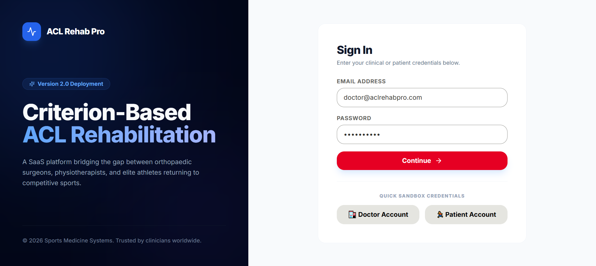
</p>

### 👩‍⚕️ Doctor Dashboard & Portal
*Manage patients, update specialized rehabilitation plans, track analytical charts, and maintain communication.*

| **Doctor Home & Overview** | **Analytical Progress Tracking** |
| :---: | :---: |
| 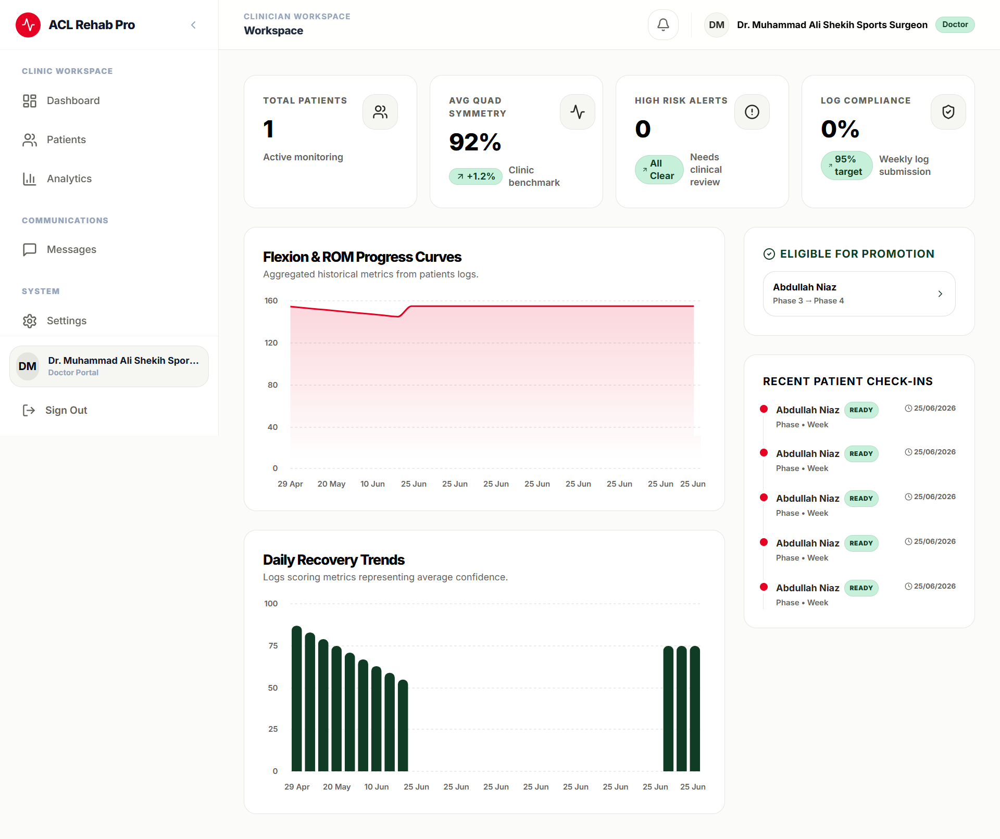 | 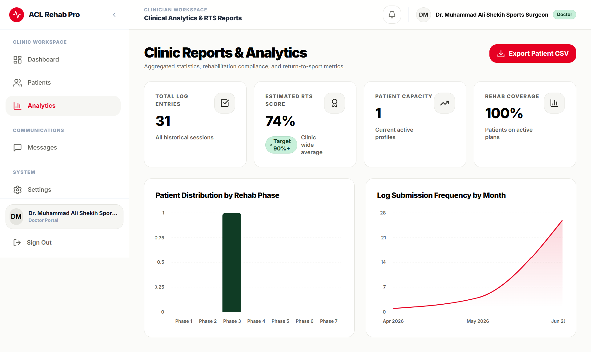 |
| **Patient Listing & Profile Info** | **Secure Clinician-Patient Chat** |
| 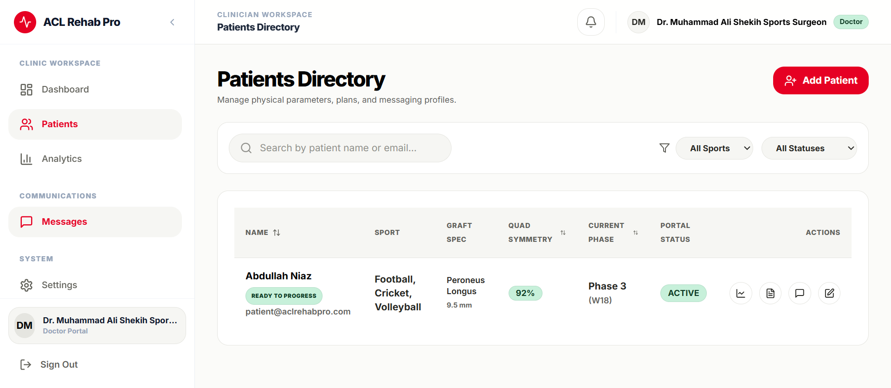 | 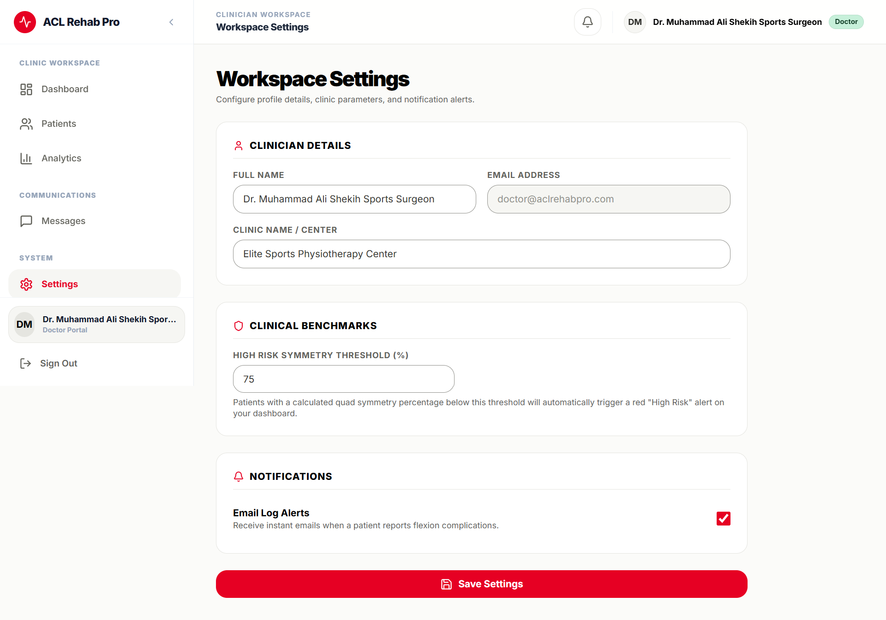 |

---

### 🏃‍♂️ Patient Dashboard & Portal
*Monitor your recovery timeline, log daily progress indicators, register joint measurements, and access your custom plan.*

| **Patient Dashboard Home** | **Active Rehabilitation Plan** |
| :---: | :---: |
| 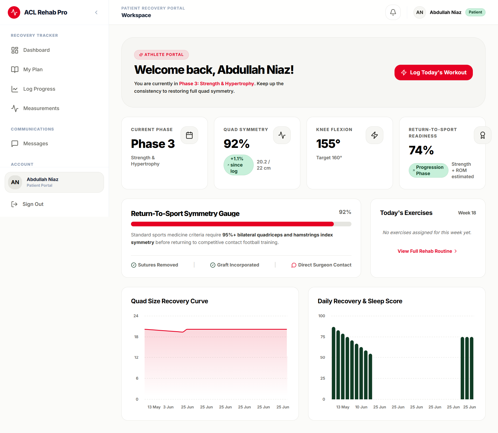 | 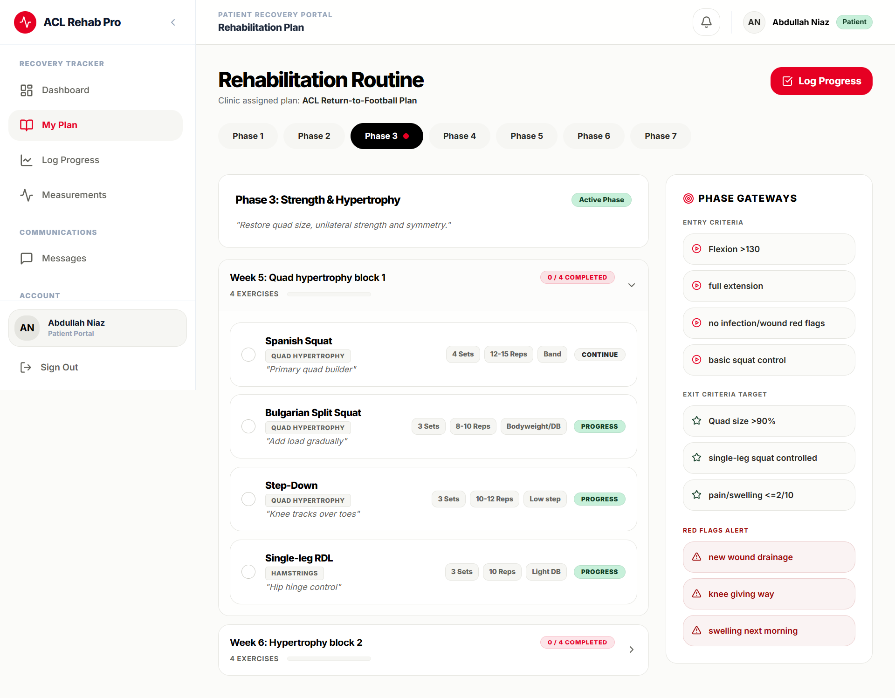 |
| **Progress Logger (Pain & Swelling)** | **Measurements (Flexion & Circumference)** |
| 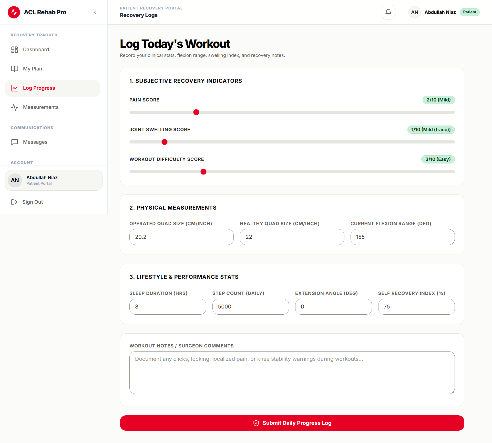 | 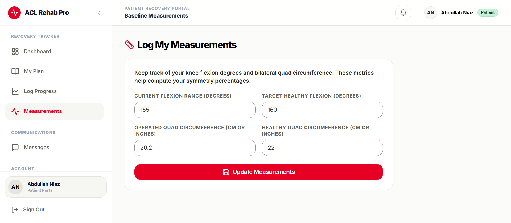 |
| **Medical Profile & Surgery Details** | **Patient Messaging Interface** |
| 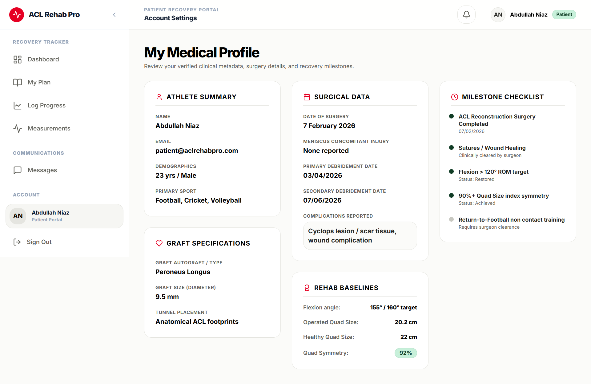 | 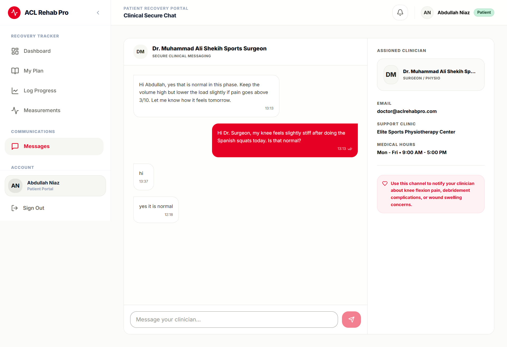 |

---

## 🚀 Key Features

### 👨‍⚕️ For Doctors (Clinicians)
* **Centralized Patient Roster:** View all assigned patients, their active rehabilitation phase, and their current week of recovery.
* **Smart Alert Flags:** High-risk indicators automatically flag patients who show complications, debridement updates, or abnormal metrics.
* **Analytical Dashboards:** Interactive line charts displaying patient recovery scores, confidence levels, quad size progression, and joint range of motion (flexion/extension) over time.
* **Rehabilitation Planner:** Fully customizable phase-by-phase planner (entry/exit criteria, week focus, specific exercises with sets, reps, load, tempo, and clinical status: *Continue, Progress, Replace, Remove*).
* **Two-way Messaging:** Direct text messaging channel with patients to address concerns.

### 🏃 For Patients (Athletes)
* **Dynamic Recovery Hub:** At-a-glance view of current phase guidelines, daily checklist completion, and quad symmetry ratio.
* **Rehab Workout Tracker:** Detailed access to daily exercise protocols prescribed by their doctor.
* **Daily Progress Logger:** Tracks daily pain, swelling, confidence, subjective difficulty levels, weight, sleep, steps, and general notes.
* **Measurement Diary:** Input physical knee measurements, including flexion degrees, extension degrees, and quadriceps circumference (both operated and healthy limbs to compute symmetry).
* **Clinical Messaging:** Instantly consult the doctor with real-time updates.

---

## 🛠️ Technology Stack

| Component | Technology | Description |
| :--- | :--- | :--- |
| **Database** | MongoDB & Mongoose | Document storage for accounts, plans, profiles, logs, and messages. |
| **Backend API** | Node.js + Express.js | REST API handles authorization, role management, and data synchronization. |
| **Frontend** | React.js + Vite | Ultra-fast client-side bundle creation with responsive rendering. |
| **Styling** | Tailwind CSS | Sleek, modern responsive styling. |
| **Data Viz** | Recharts | Render interactive graphs for patient logs and symmetry metrics. |
| **Security** | JWT & Bcrypt | Token-based stateless authentication and password hashing. |

---

## 📁 Repository Structure

```txt
acl-rehab-pro/
├── backend/                  # Node.js / Express Server
│   ├── src/
│   │   ├── config/           # Database Connection
│   │   ├── controllers/      # Route Handler Logic (auth, patient, progress, etc.)
│   │   ├── data/             # Static constants or JSON initial configurations
│   │   ├── middleware/       # JWT Auth and Role Validation Guard
│   │   ├── models/           # Mongoose Schemas (User, PatientProfile, RehabPlan, ProgressLog, Message)
│   │   ├── routes/           # REST Endpoints mapping
│   │   ├── seed/             # Database Seeding scripts
│   │   └── server.js         # Server entry point
├── frontend/                 # React SPA (Vite)
│   ├── src/
│   │   ├── api/              # Axios instance and API call wrappers
│   │   ├── components/       # Reusable layout UI pieces (Navbar, Cards, Alerts)
│   │   ├── context/          # Global React Auth & UI context providers
│   │   ├── layouts/          # Dashboards and Protected Layout wrapper shells
│   │   ├── pages/            # View Pages (Doctor views, Patient views, Login)
│   │   ├── utils/            # Calculations (e.g. quad symmetry ratio, date formatting)
│   │   └── main.jsx          # Frontend entry point
└── screenshots/              # Project images and interface screenshots
```

---

## ⚙️ Installation & Setup

### Prerequisites
* [Node.js](https://nodejs.org/) (v16+ recommended)
* [MongoDB](https://www.mongodb.com/try/download/community) installed and running locally, or a MongoDB Atlas URI connection.

### 1. Configure the Backend
Navigate to the `backend/` directory:
```bash
cd backend
cp .env.example .env
```
Update your `.env` configuration:
```env
PORT=5000
MONGO_URI=mongodb://127.0.0.1:27017/acl_rehab_pro
JWT_SECRET=your_jwt_signing_secret_here
CLIENT_URL=http://localhost:5173
```

### 2. Configure the Frontend
Navigate to the `frontend/` directory:
```bash
cd ../frontend
cp .env.example .env
```
Ensure the API target points to your backend URL:
```env
VITE_API_URL=http://localhost:5000/api
```

### 3. Install Dependencies
Return to the root directory and run the helper installations:
```bash
cd ..
npm install
npm run install-all
```

### 4. Seed the Database
Run the seeding script to populate MongoDB with a demo doctor, patient, basic rehab plan templates, and initial logs:
```bash
npm run seed
```

### 5. Launch the Application
Run both servers simultaneously:
```bash
npm run dev
```
* **Frontend client:** [http://localhost:5173](http://localhost:5173)
* **Backend server:** [http://localhost:5000](http://localhost:5000)

---

## 🔑 Demo Access Credentials

You can use the seeded test accounts to sign in immediately:

### 🩺 Clinician / Doctor Account
* **Email:** `doctor@aclrehabpro.com`
* **Password:** `Doctor123!`

### 🏃‍♂️ Patient / Athlete Account
* **Email:** `patient@aclrehabpro.com`
* **Password:** `Patient123!`

---

## ⚠️ Medical Disclaimer
This application is a software prototype designed for demonstration purposes. It does not replace direct clinical guidance or diagnosis from a qualified sports surgeon, doctor, or physiotherapist. Rehabilitation progressions should be strictly criterion-based and monitored by certified healthcare professionals.

---

## 🛠️ Future Roadmap
* **Media Uploads:** Integrations with Cloudinary or AWS S3 for uploading patient MRI scans, clinic documents, and visual joint progress photos.
* **Automated RTS Scores:** Interactive Return-to-Sport (RTS) scoring metrics based on standardized surveys (IKDC, ACL-RSI, Tampa Scale).
* **Automated Notifications:** Web sockets or email alerts when high-risk swelling is logged or new exercises are prescribed.
* **Exercise Video Library:** Integrated clip database demonstrating correct exercise execution.
* **Clinician Action Auditing:** Full history logs for edits made to rehab schedules.

---

## 📄 License
This project is proprietary. All rights reserved by Abdullah Niaz. Unauthorized copying, distribution, modification, or commercial use of this software, via any medium, is strictly prohibited without explicit written permission or a separate commercial purchase agreement. 

For licenses and usage permissions, please read the [LICENSE](file:///c:/Users/Abdullah%20Niaz/Downloads/acl-rehab-pro/LICENSE) file.
